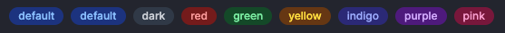

# Badge Component Explanation and Guide

[![NPM version][npm-version-image]][npm-url]
[![NPM downloads][npm-downloads-image]][npm-downloads-url]
[![MIT License][license-image]][license-url]

The Badge component is a React component that allows you to easily create badges with different styles. Depending on different color modes, it displays a badge for the selected text.

## Language

- [English](./en.md)
- [日本語](./ja.md)

## Package Information

For the latest package information, please check the [GitHub readme](https://github.com/Fun117/badge-ui#readme).

# Table of Contents

- [Badge Component](#badge-component-explanation-and-guide)
- [Table of Contents](#table-of-contents)
- [Installation](#installation)
    - [npm](#npm)
    - [yarn](#yarn)
    - [Component not generating?](#component-not-generating)
- [Change Log](#change-log)
- [ui](#ui)
- [Properties](#properties)
    - [mode](#mode-required)
    - [children](#children-required)
- [Usage Examples](#usage-examples)
- [Notes](#notes)
- [Advantages](#advantages)
- [Contributors](#contributors)

<hr/>

# Installation

## npm

```bash
npm i badge-ui
```

## yarn

```bash
yarn add badge-ui
```

## Component not generating?

Run the following command in the project's root directory:

```bash
node ./node_modules/badge-ui/install-package.js
```

<hr/>

# Change Log

-  0.0.1
    - Added module for displaying badges
-  0.0.2
    - Fixed error issues
-  0.0.3
    - Added mode 'blue'

<hr/>

# UI



# Properties

## mode (required)

Specify the display mode of the badge. The default is `default`. Supported modes are `default`, `dark`, `red`, `green`, `yellow`, `indigo`, `purple`, `pink`.

## children (required)

Specify the text or elements to be displayed inside the badge.

# Usage Examples

```tsx
<Badge mode="default">default</Badge>
<Badge mode="dark">dark</Badge>
<Badge mode="blue">blue</Badge>
<Badge mode="red">red</Badge>
<Badge mode="green">green</Badge>
<Badge mode="yellow">yellow</Badge>
<Badge mode="indigo">indigo</Badge>
<Badge mode="purple">purple</Badge>
<Badge mode="pink">pink</Badge>
```

# Notes

Please do not pass values other than the specified modes to the `mode` property. If a value other than the supported modes is passed, the default style will be applied.

Now you can effectively use the Badge component. If you have any additional information or questions, please let us know.

# Advantages

- High visibility
- Easily customizable
- Can be created with short code

# Contributors

- [Fun117](https://github.com/fun117)

**Translation: ChatGPT 3.5**

[npm-version-image]: https://badge.fury.io/js/badge-ui.svg
[npm-url]: https://www.npmjs.com/package/badge-ui
[npm-version-image]: https://img.shields.io/npm/v/badge-ui.svg?style=flat
[npm-url]: https://npmjs.org/package/badge-ui
[npm-downloads-image]: https://img.shields.io/npm/dm/badge-ui.svg?style=flat
[npm-downloads-url]: https://npmcharts.com/compare/badge-ui?minimal=true
[license-image]: https://img.shields.io/badge/license-MIT-blue.svg?style=flat
[license-url]: ../LICENSE.txt