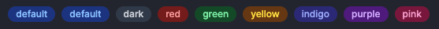

# Badgeコンポーネント解説とガイド

[![NPM version][npm-version-image]][npm-url]
[![NPM downloads][npm-downloads-image]][npm-downloads-url]
[![MIT License][license-image]][license-url]

Badgeコンポーネントは、異なるスタイルのバッジを簡単に作成できるReactコンポーネントです。異なるカラーモードに応じて、選択したテキストに対するバッジを表示します。

## language

- [English](./en.md)
- [日本語](./ja.md)

## パッケージ情報

最新のパッケージ情報は[GitHubのreadme](https://github.com/Fun117/badge-ui#readme)を確認してください。


# 目次

-  [Badgeコンポーネント](#badgeコンポーネント解説とガイド)
-  [目次](#目次)
-  [インストール](#インストール)
    -  [npm](#npm)
    -  [yarn](#yarn)
    -  [コンポーネントが生成されない？](#コンポーネントが生成されない)
-  [変更履歴](#変更履歴)
-  [プロパティー](#プロパティー)
    -  [mode](#mode-必須)
    -  [children](#children-必須)
-  [使用例](#使用例)
-  [注意事項](#注意事項)
-  [利点](#利点)
-  [貢献者](#貢献者)

<hr/>

# インストール

## npm

```bash
npm i badge-ui
```

## yarn

```bash
yarn add badge-ui
```

## コンポーネントが生成されない？

プロジェクトのルートディレクトリーで以下のコマンドを実行することで生成されます。

```bash
node ./node_modules/badge-ui/install-package.js
```

<hr/>

# 変更履歴

-  0.0.1
    - Badge表示用モジュールを追加
-  0.0.2
    - エラー問題を修正
-  0.0.3
    - modeに'blue'を追加

<hr/>

# UI



# プロパティー

## mode (必須)

バッジの表示モードを指定します。デフォルトは `default` です。サポートされているモードは `default` `dark` `blue` `red` `green` `yellow` `indigo` `purple` `pink` です。

## children (必須)

バッジ内に表示するテキストや要素を指定します。


# 使用例

```tsx
<Badge mode="default">デフォルト</Badge>
<Badge mode="dark">ダーク</Badge>
<Badge mode="blue">ブルー</Badge>
<Badge mode="red">レッド</Badge>
<Badge mode="green">グリーン</Badge>
<Badge mode="yellow">イエロー</Badge>
<Badge mode="indigo">インディゴ</Badge>
<Badge mode="purple">パープル</Badge>
<Badge mode="pink">ピンク</Badge>
```

# 注意事項

`mode` プロパティには指定されたモード以外の値を渡さないでください。サポートされているモード以外の値が渡された場合、デフォルトのスタイルが適用されます。

これで、Badgeコンポーネントを効果的に使用できるようになりました。他にも必要な情報や質問があればお知らせください。

# 利点

- 高い視認性
- 簡単にカスタマイズ可能
- 短いコードで作成可能

# 貢献者

-  [Fun117](https://github.com/fun117)

**Translation: ChatGPT 3.5**

[npm-version-image]: https://badge.fury.io/js/badge-ui.svg
[npm-url]: https://www.npmjs.com/package/badge-ui
[npm-version-image]: https://img.shields.io/npm/v/badge-ui.svg?style=flat
[npm-url]: https://npmjs.org/package/badge-ui
[npm-downloads-image]: https://img.shields.io/npm/dt/badge-ui.svg?style=flat
[npm-downloads-url]: https://npmcharts.com/compare/badge-ui?minimal=true
[license-image]: https://img.shields.io/badge/license-MIT-blue.svg?style=flat
[license-url]: ../LICENSE.txt